=========================
The application dashboard
=========================

By selecting an app in the application list, you will have access to a control panel with different views.

************
General view
************

The general view gives you a summary of the application’s details. 
It contains information about real-time usage statistics of memory and disk, as well as a control panel and the application’s history.

Stop/Start/Reload your application
==================================

You can access the control panel to manage the state of your remote application: stop it, start it or reload it.

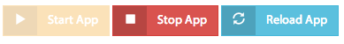

Summary
=======

The summary block displays the current information related to the git repository

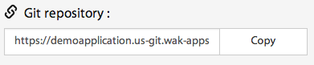

or the RAM and Disk currently in use by your application

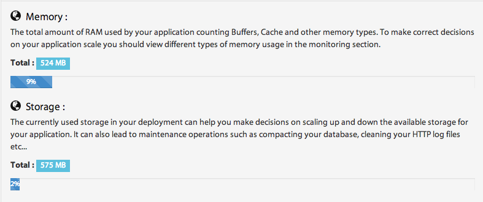

It will help you to make the correct decisions to scale your application up and down.

Application logs
================

The recent actions you have executed are displayed in the associated view. 

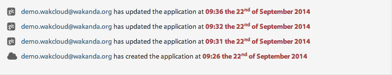

If you want more detailed logs you can click on the ``application logs`` button to be redirected to the application logs view.

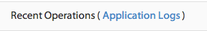

***************
Monitoring view
***************

The monitoring view allows you to monitor the activity of your application, by charting usage statistics of memory, storage and network I/O.

Graph's time-frame
==================

You can configure the time frame of your graphs by setting a display window 

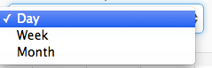

and a starting point	

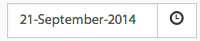

Add metrics
===========

You can add new metrics to a graph simply by clicking on the add button ``+`` , selecting the metric you want from the list and then clicking on ``add to graph`` button 

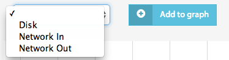

You can also hide or show your selected metrics from the graph by clicking on the control button.

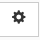

Delete/add graphs
=================

The ``x`` button allows you to delete the graph from the monitoring view.

To add a new graph, you simply click on the ``new chart`` button 

************
Domains view
************

Wakanda allows for multi-project applications. To get them running you need subdomains or custom domains to relay received requests to the correct project.

Add a sub domain
================

You can add new subdomains by typing the subdomain you want and clicking on the add button.

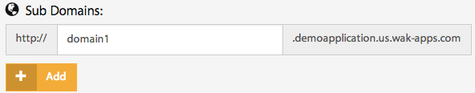

The newly created subdomain will be automatically added to the list of your application’s subdomains.

.. note::

	A subdomain must be unique.

Add a custom domain
===================

If you have domains you want to bind with your application, you simply have to add it in the custom domains section.
You insert your custom domain and then click on the add button 

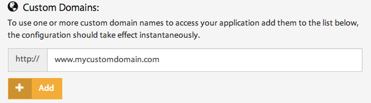

The newly bound custom domain will be automatically added to the list of your application’s custom domains.

****************
Permissions view
****************

The Permissions view offers the ability to work in a collaborative mode by managing user and group permissions.

Create a group
==============

You can create a new group by clicking on the ``add group`` button 

A new pop up appears inviting you to type in:

-	The name of the group 
-	The collaborators emails in the add users section 
-	The permissions for this group of users 

Then you click on the save changes button and your newly created group will be added to the groups list

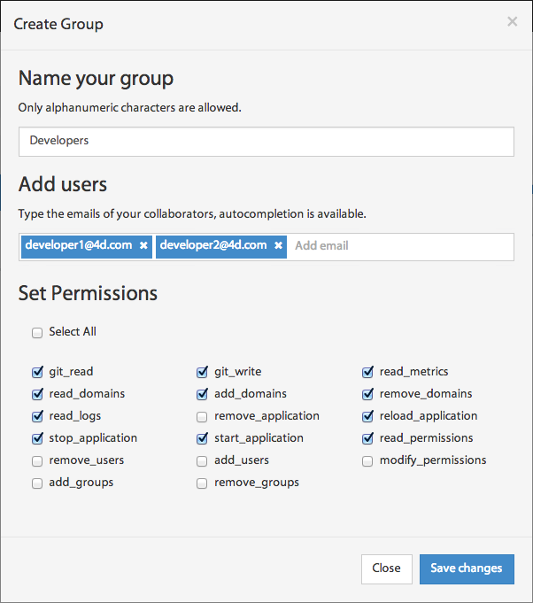

.. note::

    The owner group is automatically created with your application and contains your email only; no other user can be added to it.

Manage users
============

Within the users panel, you can add or remove collaborators from the selected group.
To add a new user to the group you click on the ``add users to the group`` link or the ``manage users`` button

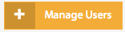

and then type in the user’s email and click on invite or select an existing user from one of your application’s existing groups

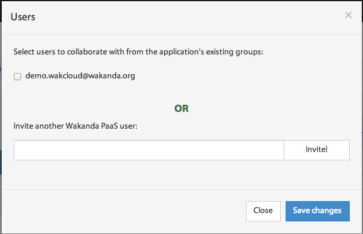

You can also delete a user from a group by clicking on the ``X`` button in the user panel or in the manage users view by deselecting it.

Configure group permissions
===========================

You can configure group permissions by clicking on the ``lock`` button.

A predefined list of permissions appears where you can select/deselect the permissions you want to attribute to the group and then save the changes.

Delete a group
==============

You delete a group by simply clicking on the ``X`` button of the group.