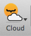
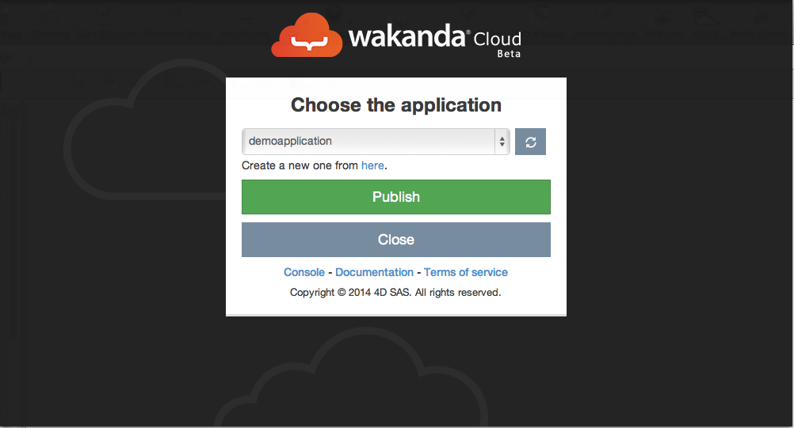
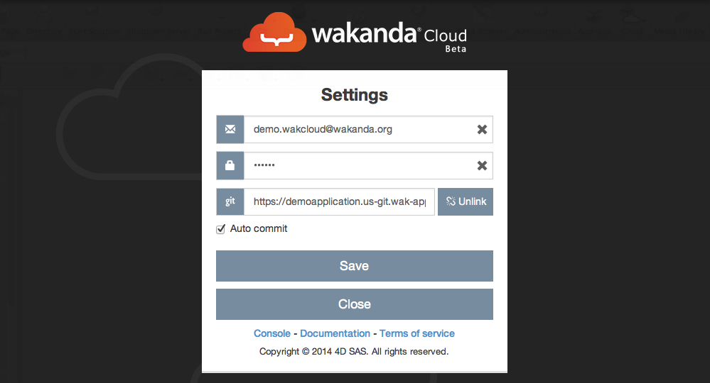

===========================
The Wakanda Cloud extension
===========================

The cloud extension

allows you to publish and clone your applications.

*******
Publish
*******

You can use the publish functionality once you have created your application and are ready to deploy it to the cloud.
The first publish operation will require some additional steps to bind the remote application with the local one.

First publish
=============

The few steps bellow show you how to deploy your application to the cloud for the first time:
1-	Open your local application in Wakanda Studio
2-	Click on the cloud extension.
3-	Login to your Wakanda aPaaS account
4-	Choose the remote solution where you want to publish your application
5-	Click on the publish button.
6-	Access your remote application by clicking on the link.

Publish modifications
=====================

After the first deployment, you can publish the updates of your application just by clicking on the cloud button from the studio.

*****
Clone
*****

The clone feature allows you to share your application with your collaborators or to enjoy a high mobility by cloning your remote application no matter where you are.
You can perform a clone operation by clicking on the clone feature 

.. image:: images/22_clone_selection.png
	:align: center

and selecting the application you want to clone. 
The chosen application will automatically be added to the list of your applications.

********
Settings
********

In the settings panel you can change your credentials, change the git repository linked to your local application and activate or deactivate the auto-commit feature.

.. image:: images/23_setting_selection.png
	:align: center

Change information
==================

You can change your credentials or the git repository linked to your application by opening the settings panel, change the information your want and then click on save.

Auto-commit
===========

By activating this feature, the cloud extension will automatically publish your modifications.

Otherwise, if this feature is deactivated, every time you will want to publish your application you will have to manually choose the files that you specifically want to deploy to your remote application.

.. image:: images/25_deactivated_autocommit.png
	:align: center

To activate or deactivate this feature you open the settings panel and check/uncheck the auto-commit checkbox and then click on save.	

