=========
Dashboard
=========

The main view of the console gives you access to the list of your own and shared applications.
Each row in the list describes the region the application is created in as well as the offer type and the owner if the application is not yours. it also includes quick action buttons to preview the app, delete it or get its detailed view.

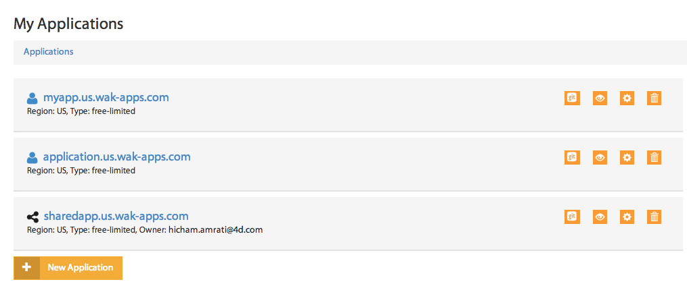

When you select an application from the list, a control panel with different views appears.

************
General view
************

The general view gives you real-time statistics of the memory and disk space usage.
This view also provides a control panel to manage your app, as well as a log of the most recent operations performed.

Stop/Start/Reload your application
==================================

You can access the control panel to manage the state of your remote application. You can do one of the three following actions: start,stop or reload the application.

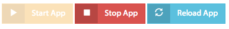

Summary
=======
The summary block displays information regarding memory's and disk space's current usage. It also provides a quick shortcut to the Git repository associated to your app.

.. image:: images/2_git_repository.png
	:align: center

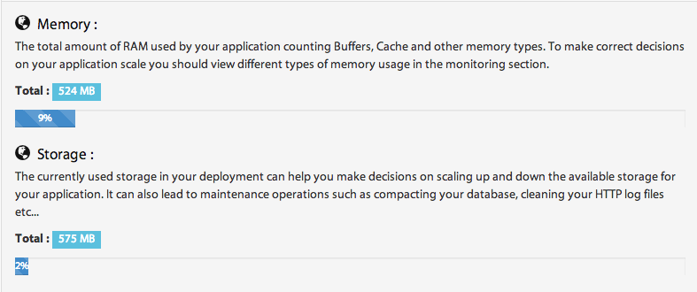

This summary will help you make the correct decisions about scaling either up or down your application.

Application logs
================

The recent actions you or your collaborators have executed (update permissions, publish app, ...) are displayed in this view.

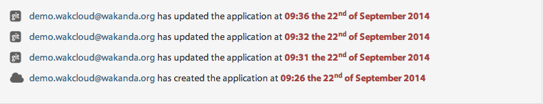

***************
Monitoring view
***************

The monitoring view allows you to monitor the activity of your application, by charting the usage statistics of memory, storage and network throughput.

Graph's time-frame
==================

You can select a time frame for your graphs by setting a display window as well as a starting date: 

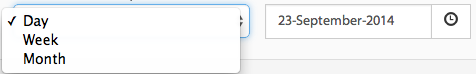

Metrics
=======

You can add new metrics to a graph simply by clicking on the ``+`` button, selecting the metric you want from the list, and clicking on ``Add to graph`` button 

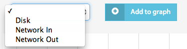

You can also hide or show your selected metrics from the graph by clicking on the control button.

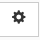

Delete/add graphs
=================

The ``x`` button allows you to delete the graph from the monitoring view.

To add a new graph, click on the ``New chart`` button 

************
Domains view
************

Wakanda Cloud allows you to bind your custom domains to your cloud applications.

Adding a custom domain
======================

If you have purchased domain names from a registrar, and you want it bound to your application, you simply have to add them in the custom domains section.
To do so, you enter a custom domain in the corresponding field and then click on the ``Add`` button 

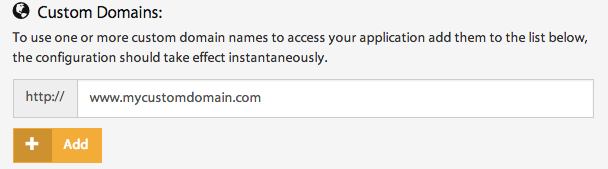

The custom domain will be automatically added to the list of your application’s custom domains.

****************
Permissions view
****************

The permissions view offers you a way to work in a collaborative mode by creating groups, inviting users and managing their permissions.

Creating a group
================

You can create a new group by clicking on the ``Add Group`` button 

.. note::

    The ``Owner`` group is created automatically with every application. The only user it contains is the application's owner.	

The pop-up that shows up allows you to:

-	Set a name for the group. 
-	Type the emails of the collaborators in the ``Add users`` section.
-	Set custom permissions for the group.

Click on the ``save`` button to create the group

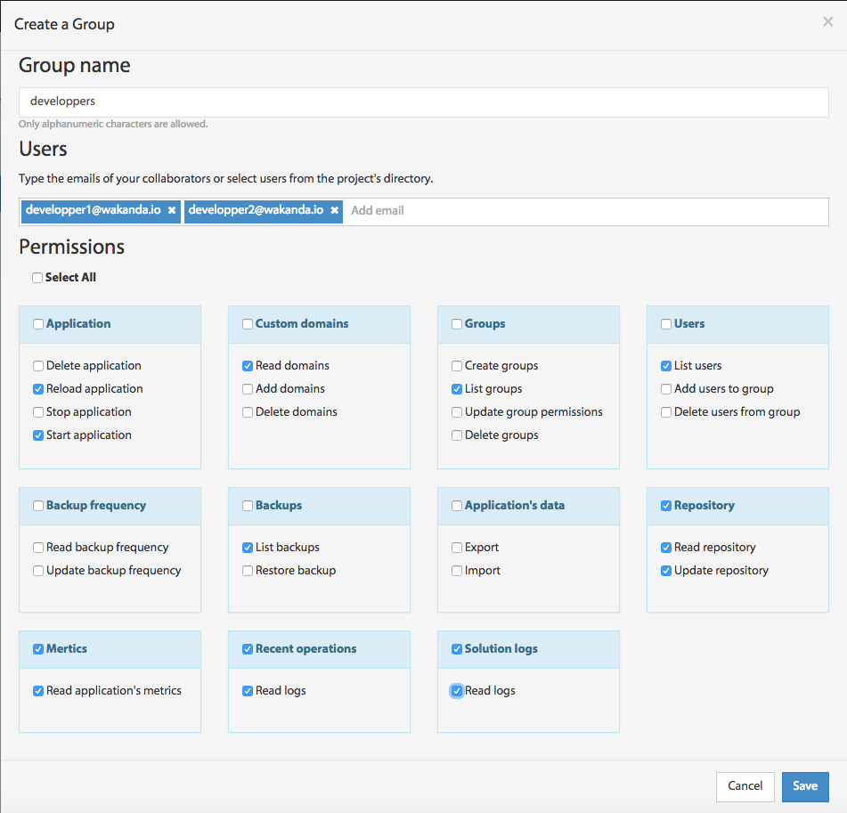

Managing users
==============

On the users panel, you can add or remove collaborators from a selected group.
To add a new user to a group, click on the ``Manage Users`` button or on the ``Add users to the group`` link if the group does not contain any users yet.

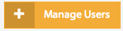

Type in the user’s email and click on ``Invite`` or, if the user is also a collaborator in one of your other groups, select him/her from the shown list.

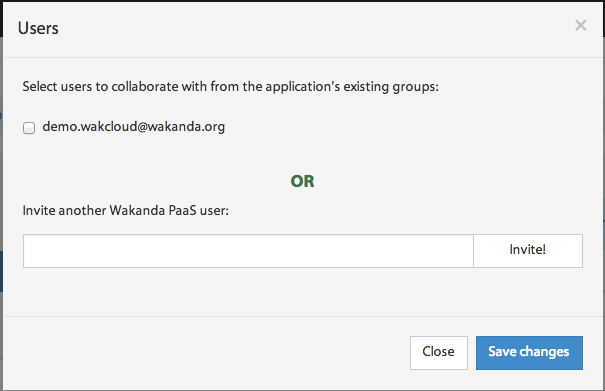

You can also delete a user from a group by clicking on the ``X`` button in the user panel or in the manage users view by deselecting him/her.

Configuring group permissions
=============================

You can configure group permissions by clicking on the |lock| button.

A predefined list of permissions appears where you can select/deselect the permissions you want to attribute to the group and then save the changes.

Deleting a group
================

You delete a group by simply clicking on the ``X`` button next to the group name.

.. note:: 

	You should delete all users in a group before deleting it.

*************
Database view
*************

The database view allows you to manage your application's data, from scheduling your backups to exporting your remote waData file.

Data backups
============

You can schedule, download and restore your backups in this view.

To schedule a backup you simply have to set the frequency and the time you want to start your full backups.

The frequency of the incremental backups depend on the choice you have made.

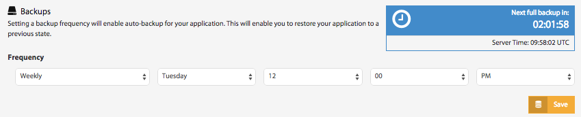

There are three frequencies you can choose from:

-	Daily: a full backup of your application's data will occur every day at the time you have specified. An incremental backup is executed every hour.
		This frequency is suitable for applications in which data is critical and requires a fine level of restore points.
-	Weekly: a full backup of your application's data will occur every week at the day and time you have specified. An incremental backup is executed once every 6 hours.
		This type of frequency is a good compromise between the uptime of your application and the restore points available.
-	Monthly: a full backup of your application's data will occur every month at the date and time you have specified. An incremental backup is executed every 24 hours.
		If the uptime of your application is something you care about, this frequency is most suited for your application. The full backup is only performed once a month and lets you have daily restore points.

You can also find the list of completed backups 

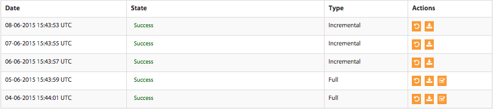

Each row contains information about the backup made at that point in time. It includes the date of the backup, its state, its type and the various actions that can be done on it (download backup file, restore it, or the download its verify report).

Import and export Data
======================

You can easily manage your remote application's data by importing and exporting your waData file in this view.

To import your waData file to your remote application, you can drag and drop the waData file in the specified section or select it by clicking on ``Select File`` button.

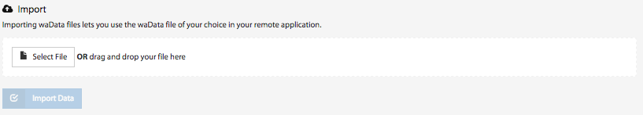

Once the waData file is selected, click on the ``Import Data`` button and your newly imported data will take effect.

To export your remote application waData file, click on the ``Export Database`` and the download should start shortly after

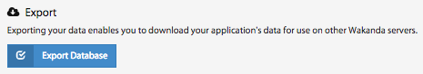

*********
Logs view
*********

The logs view allows you to access your Wakanda Solution's logs.

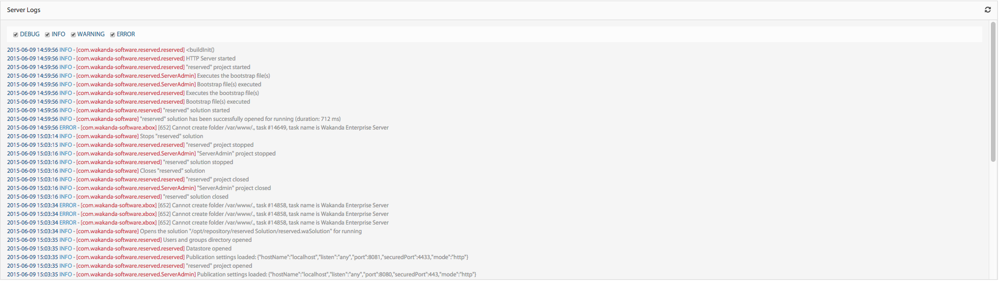

************
Profile view
************	

The profile view allows you to manage your personal, billing and entreprise information.

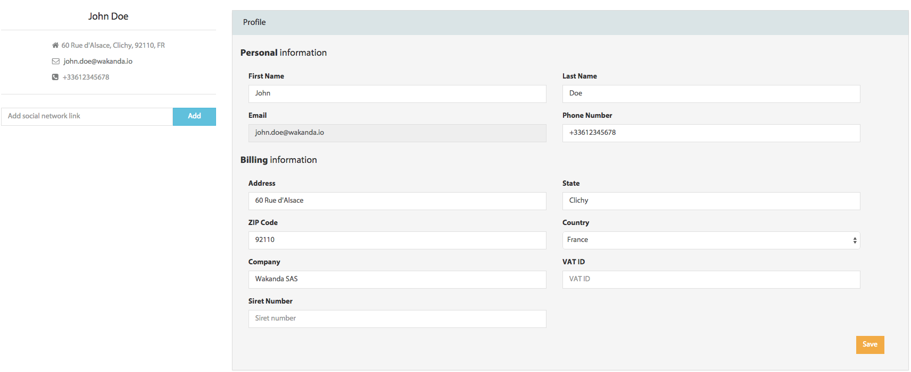
