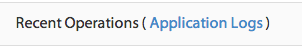
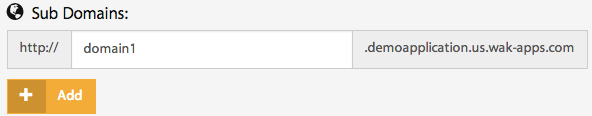
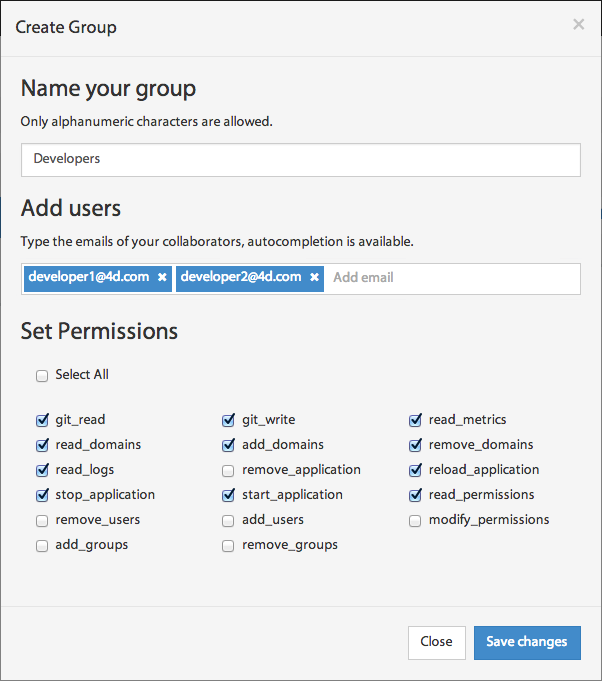

=========
Dashboard
=========

When you select an application from the list, a control panel with different views appears.

************
General view
************

The general view gives you real-time usage statistics of the memory and disk space. There is also a control panel and the application’s history.

Stop/Start/Reload your application
==================================

You can access the control panel to manage the state of your remote application. You can do one of the three following actions on your application: start,stop or reload.

.. image:: images/1_control_panel.png
	:align: center

Summary
=======

The summary block displays the current information related to the Git repository as well as the RAM and disk space currently being used by your application

.. image:: images/2_git_repository.png
	:align: center

.. image:: images/3_memory_disk_statistics.png
	:align: center

It will help you make the correct decisions about scaling either up or down your application.

Application logs
================

The recent actions you have executed are displayed in the associated view. 

.. image:: images/4_recent_operations.png
	:align: center

If you want to access your Wakanda Solution logs, click on the ``Application Logs`` button to be redirected to the application logs view.

***************
Monitoring view
***************

The monitoring view allows you to monitor the activity of your application, by charting the usage statistics of memory, storage and network I/O.

Graph's time-frame
==================

You can select a time frame for your graphs by setting a display window as well as a starting date: 

.. image:: images/6_time_frame.png
	:align: center

Metrics
=======

You can add new metrics to a graph simply by clicking on the ``+`` button, selecting the metric you want from the list, and clicking on ``Add to graph`` button 

.. image:: images/9_add_metrics.png
	:align: center

You can also hide or show your selected metrics from the graph by clicking on the control button.

.. image:: images/10_graph_parameter_button.png
	:align: center

Delete/add graphs
=================

The ``x`` button allows you to delete the graph from the monitoring view.

To add a new graph, click on the ``New chart`` button 

.. image:: images/11_add_chart.png
	:align: center

************
Domains view
************

Wakanda allows for multi-project applications. To get them running you need subdomains or custom domains to relay received requests to the correct project.

Adding a subdomain
==================

You can add new subdomains by typing the subdomain you want and clicking on the ``Add`` button.

The newly created subdomain will be automatically added to the list of your application’s subdomains.

.. note::

	The name of the subdomain must be unique.

Adding a custom domain
======================

If you have domains you want to bind to your application, you simply have to add it in the custom domains section.
To do so, you enter a custom domain and then click on the ``Add`` button 

.. image:: images/13_custom_domain_view.png
	:align: center

The custom domain will be automatically added to the list of your application’s custom domains.

****************
Permissions view
****************

The Permissions view offers you a way to work in a collaborative mode by managing permissions for users and groups.

Creating a group
================

You can create a new group by clicking on the ``Add Group`` button 

.. image:: images/14_add_group_button.png
	:align: center

You must do the following:

-	Enter the name of the group. 
-	Enter the emails of the collaborators in the Add users section.
-	Set the permissions for the group.

Click on the save changes button to create the group

.. note::

    The ``Owner`` group is created automatically with every application. It contains only the email of the application's owner.

Managing users
==============

On the users panel, you can add or remove collaborators from a selected group.
To add a new user to the group, you click on the ``Add users to the group`` link or the ``Manage Users`` button

.. image:: images/17_manage_user_button.png
	:align: center

Type in the user’s email and click on ``Invite`` or select an existing user from one of your application’s existing groups

.. image:: images/18_add_user_window.png
	:align: center

You can also delete a user from a group by clicking on the ``X`` button in the user panel or in the manage users view by deselecting it.

Configuring group permissions
=============================

You can configure group permissions by clicking on the |lock| button.

.. |lock| image:: images/19_permission_button.png

A predefined list of permissions appears where you can select/deselect the permissions you want to attribute to the group and then save the changes.

Deleting a group
================

You delete a group by simply clicking on the ``X`` button next to the group name.