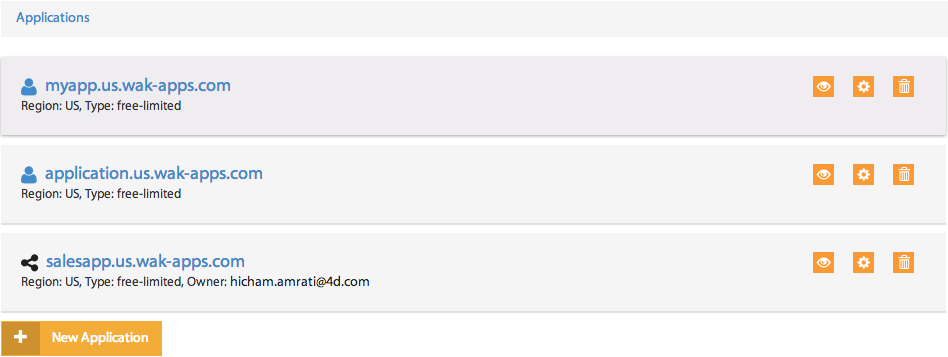

=========
Dashboard
=========

The main view of the console gives you access to the list of your own and shared applications.
Each row in the list describes the region the application is created in as well as the offer type and the owner if the application is not yours. it also includes quick action buttons to preview the app, delete it or get its detailed view.

When you select an application from the list, a control panel with different views appears.

************
General view
************

The general view gives you real-time statistics of the memory and disk space usage.
This view also provides a control panel to manage your app, as well as a log of the most recent operations performed.

Stop/Start/Reload your application
==================================

You can access the control panel to manage the state of your remote application. You can do one of the three following actions: start,stop or reload the application.

.. image:: images/1_control_panel.png
	:align: center

Summary
=======
The summary block displays information regarding memory's and disk space's current usage. It also provides a quick shortcut to the Git repository associated to your app.

.. image:: images/2_git_repository.png
	:align: center

This summary will help you make the correct decisions about scaling either up or down your application.

Application logs
================

The recent actions you have executed (edit permissions, publish app, ...) are displayed in the associated view. 

.. image:: images/4_recent_operations.png
	:align: center

If you want to access your Wakanda Solution logs, click on the ``Application Logs`` button to be redirected to the application logs view.

***************
Monitoring view
***************

The monitoring view allows you to monitor the activity of your application, by charting the usage statistics of memory, storage and network throughput.

Graph's time-frame
==================

You can select a time frame for your graphs by setting a display window as well as a starting date: 

Metrics
=======

You can add new metrics to a graph simply by clicking on the ``+`` button, selecting the metric you want from the list, and clicking on ``Add to graph`` button 

.. image:: images/9_add_metrics.png
	:align: center

You can also hide or show your selected metrics from the graph by clicking on the control button.

.. image:: images/10_graph_parameter_button.png
	:align: center

Delete/add graphs
=================

The ``x`` button allows you to delete the graph from the monitoring view.

To add a new graph, click on the ``New chart`` button 

************
Domains view
************

Wakanda allows for multi-project applications. To get them running you need subdomains or custom domains to relay received requests to the correct project.

Adding a subdomain
==================

You can add new subdomains by typing a name for your subdomain in the corresponding field and clicking on the ``Add`` button.

.. image:: images/12_subdomains_view.png
	:align: center

The newly created subdomain will be automatically added to the list of your application’s subdomains.

.. note::

	The name of the subdomain must be unique.

Adding a custom domain
======================

If you have purchased domain names from a registrar, and you want it bound to your application, you simply have to add them in the custom domains section.
To do so, you enter a custom domain in the corresponding field and then click on the ``Add`` button 

.. image:: images/13_custom_domain_view.png
	:align: center

The custom domain will be automatically added to the list of your application’s custom domains.

****************
Permissions view
****************

The permissions view offers you a way to work in a collaborative mode by creating groups, inviting users and managing their permissions.

Creating a group
================

You can create a new group by clicking on the ``Add Group`` button 

The pop-up that shows up allows you to:

-	Set a name for the group. 
-	Type the emails of the collaborators in the ``Add users`` section.
-	Set custom permissions for the group.

Click on the ``save changes`` button to create the group

.. image:: images/15_add_group_window.png
	:align: center

.. note::

    The ``Owner`` group is created automatically with every application. The only user it contains is the application's owner.

Managing users
==============

On the users panel, you can add or remove collaborators from a selected group.
To add a new user to a group, click on the ``Manage Users`` button or on the ``Add users to the group`` link if the group does not contain any users yet.

.. image:: images/17_manage_user_button.png
	:align: center

Type in the user’s email and click on ``Invite`` or, if the user is also a collaborator in one of your other groups, select him/her from the shown list.

.. image:: images/18_add_user_window.png
	:align: center

You can also delete a user from a group by clicking on the ``X`` button in the user panel or in the manage users view by deselecting him/her.

Configuring group permissions
=============================

You can configure group permissions by clicking on the |lock| button.

.. |lock| image:: images/19_permission_button.png

A predefined list of permissions appears where you can select/deselect the permissions you want to attribute to the group and then save the changes.

Deleting a group
================

You delete a group by simply clicking on the ``X`` button next to the group name.

.. note:: 

	You should delete all users in a group before deleting it.
