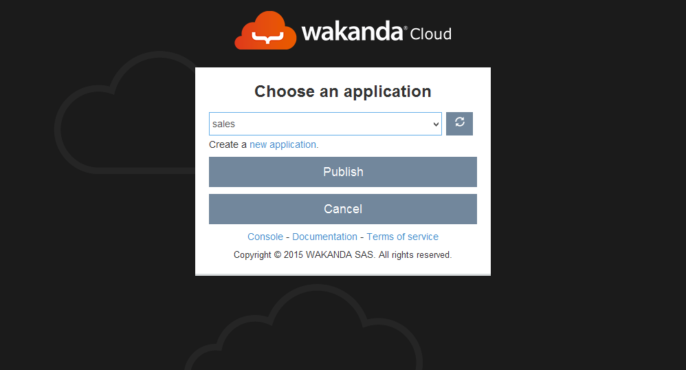
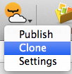
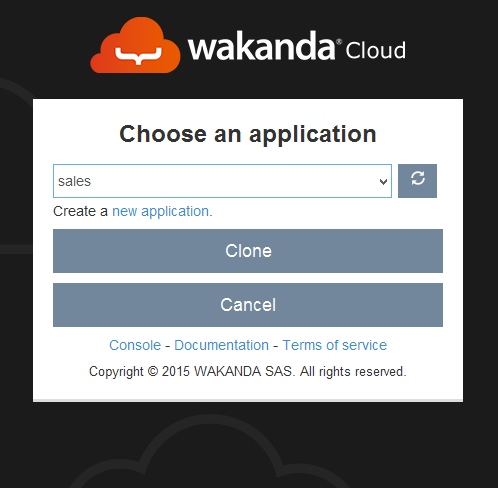
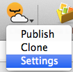
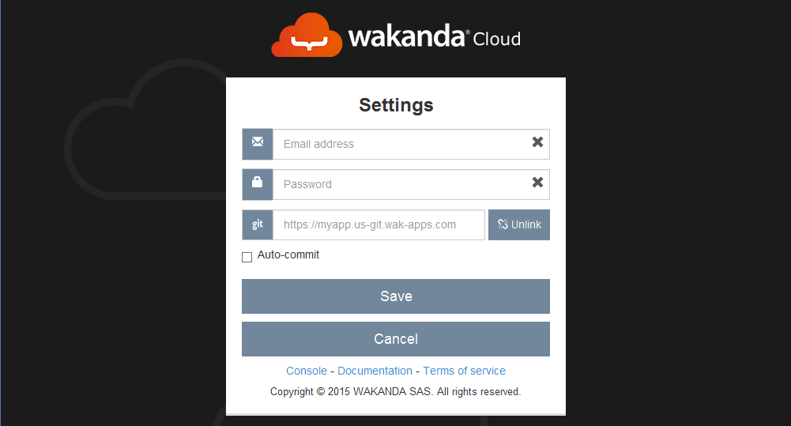
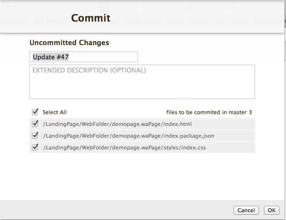

=======================
Wakanda Cloud extension
=======================

The Cloud Extension allows you to interact with the Wakanda Cloud Service from Wakanda Studio.

***************************
Publishing your application
***************************

At any moment during your development, you can publish your application to Wakanda Cloud by clicking on the ``Cloud`` button.

Once published, you can update your remote application by simply clicking on the ``Cloud`` button or on the ``Publish`` menu item.

Publishing for the first time
=============================

To deploy your application to the cloud for the first time:

1.	Open your local application in Wakanda Studio.
2.	Click on the ``Cloud`` button.
3.	Type in your Wakanda Cloud credentials.
4.	Select the target remote application.
5.	Click on the ``Publish`` button.

Updating the remote application
===============================

After the first deployment, you can update your remote application by clicking on the ``Cloud`` button or the ``Publish`` menu item. If you want to be able to choose the files to publish to the remote application, disable the `Auto-Commit`_ option.

***********************
Cloning the application
***********************

The clone feature allows you to download your entire remote application, including its modifications history.

To clone an already published Wakanda application, click on the ``Clone`` menu item

Select the source application from the list and click on ``Clone``.

Once the  application is cloned, the solution will be opened automatically in Wakanda Studio.

********
Settings
********

You can customize the behaviour of the Wakanda Cloud Studio Extension via the settings menu item

Wakanda Cloud credentials
=========================

To edit your Wakanda Cloud credentials just type the new values in the corresponding fields. It is also possible to completely remove your existing credentials by emptying both the login and password fields.

To save your modifications click on ``Save``.

Remote Git Repository
=====================

You can configure the default target remote application for each Wakanda Solution by typing in the URL in the git field. This will avoid you having to select a target remote application each time you perform a publish operation.

To save your modifications click on ``Save``.

Once configured, the remote application will be linked to your local one. To unlink it, simply click on the Unlink button in the settings dialog.

Auto-commit
===========

When enabled, this feature allows the studio to publish all the local modifications to the remote application automatically.

If, otherwise, the ``auto-commit`` checkbox is disabled, you will be asked to choose the files to be published to the remote application whenever you click on the ``Cloud`` button or the ``Publish`` menu item.

