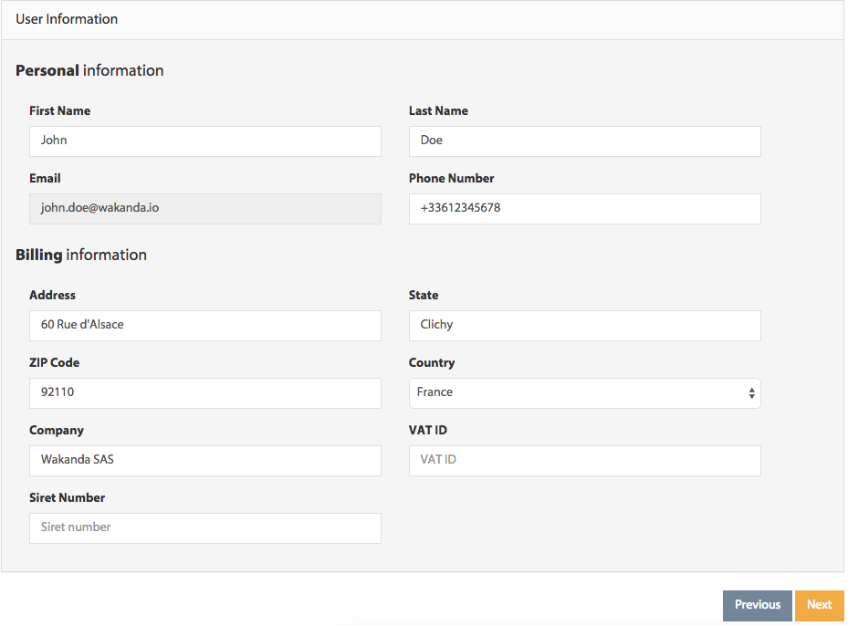

===============
Getting Started
===============

*******************************
Creating your first application
*******************************

Once you are connected to the dashboard, click on the ``New Application`` button to open the application creation wizard.

.. image:: images/noapps.png
	:align: center
	
Start by choosing an application type from the suggestions. In our example, we will be creating a free application. To proceed, click on the ``Free application`` button.

	
By default, your application will be created in the US. If you prefer a different region, you can select it from the list.

.. image:: images/region.png
	:align: center
.. note::

    As of the moment, only the US region is available

Choose a valid application name:

.. image:: images/domain.png
	:align: center

Optionally, you can add custom domains to your application's configuration.

.. image:: images/custom_domains.png
	:align: center

In the next step, you are invited to provide your user's information

.. note::

    Before proceeding to the next step, all the required fields must be filled.
    The required fields are:
    - Personal information: first name and last name
    - Billing information: address, country and zip code

Before creating your application, you must agree to our terms of service and then click on the ``save`` button.

**************************************
Publishing & updating your application
**************************************

Publishing your code the first time is the same as updating an already deployed application. All you need to do is push your code to your application's remote repository, which can be done using Wakanda Studio, Git Command Line, or any IDE that supports Git Smart HTTP.

Application remote repository
=============================

You can get your application's remote repository URL in the app's git repository section. 

.. image:: images/2_git_repository.png
	:align: center

Using Wakanda Studio
====================

Once you have opened your solution in Wakanda Studio, click on the Cloud button in the toolbar and select the ``Publish`` menu item.

.. image:: images/studio_update_menu.png
	:align: center

Fill in your Wakanda Cloud login information and click  ``Login``. If you want Wakanda Studio to remember your credentials, check the ``Remember me`` checkbox.

.. image:: images/studio_login_dialog.png
	:align: center

.. note::

    If you check the ``Remember me`` checkbox, your credentials will be saved as plain text in the Wakanda Cloud's preferences.
	
If this is your first deployment, you will need to associate a domain name to your application.

.. image:: images/21_publish_window.png
	:align: center

If the operation was successful, you will receive details about the update. Otherwise, you will receive a message explaining any errors that occurred.

.. image:: images/studio_published_dialog.png

Using the command line
======================

Push your application to the remote repository by using the following command ::

    $ git push https://[my-application-name].us-git.wak-apps.com master

.. note::

    If your local repository is using a branch name other than ``master``, you must use the following command to push your application to the remote repository ::

    $ git push https://[my-application-name].us-git.wak-apps.com [local-branch-name]:master
