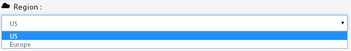
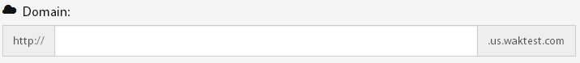
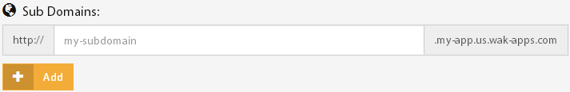
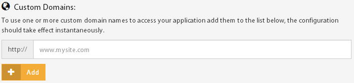
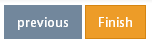
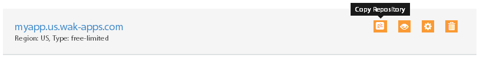
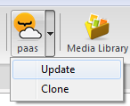
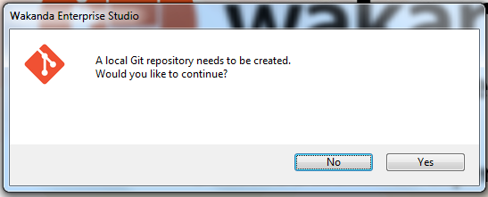
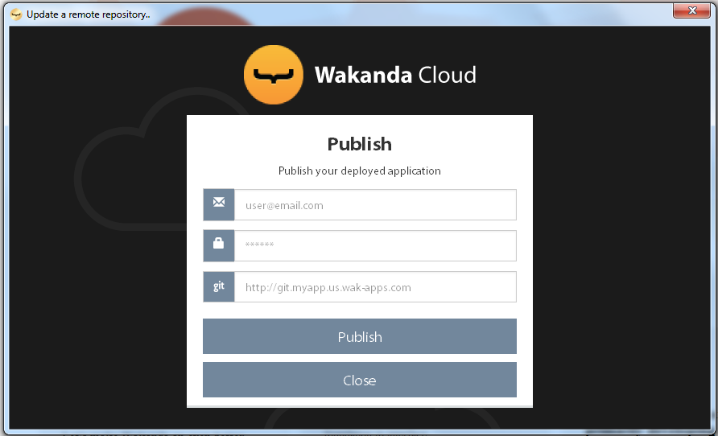
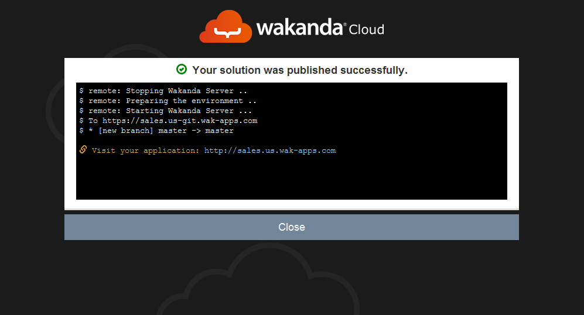

===============
Getting Started
===============

The following video demonstrates how to create an application from the dashboard and how to delpoy and update it using the studio.

.. raw:: html

 <iframe width="420" height="315" src="//www.youtube.com/embed/5c2BeD-S958" frameborder="0" allowfullscreen></iframe>  

You can read the rest of this guide for a more detailed explanation.

*****************************
Creating my first application
*****************************

Once you are connected to your dashboard, click on the ``create your first app`` link to open the application creation wizard.

Start by choosing an application type from the suggested offers, in our case we will be creating a free application. To do so click on the ``Try it now`` button.

By default, your application will be created in the US region, you can change that by choosing a different region from the list.

Choose a valid application name

Optionally, you can add subdomains and custom domains to your application's configuration.

To create your application click on the ``Finish`` button.

********************************
Updating my deployed application
********************************

To update your deployed application all you need to do is push your new code to your application's remote repository.
This can be done using the Studio's PaaS Extension, GIT Command Line or any IDE supporting GIT Smart HTTP.

Application remote repository
=============================

You can get your application's remote repository URL by clicking the ``copy repository`` button 

Using the Studio
================

Once you have opened your solution in Wakanda Studio, click on the PaaS extension button and select the ``update`` menu

If you have not initialized a local Git repository for your solution yet, you will be prompted to create one, click on the ``Yes`` button

Fill in your PaaS login information and your `application remote repository`_ URL and click on ``Publish``

Once the operation is conducted successfully you will receive details about the update, otherwise you will receive a message explaining the origin of the error

Using the command line
======================

Push your application to the remote repository using the following command ::

    $ git push http://git.[my-application-name].us.wak-apps.com master

.. note::

    If your local repository is using a branch name other than ``master`` ::

    $ git push http://git.[my-application-name].us.wak-apps.com [local-branch-name]:master
