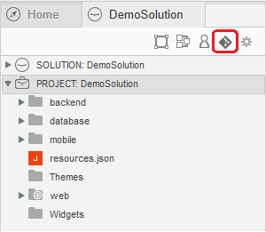
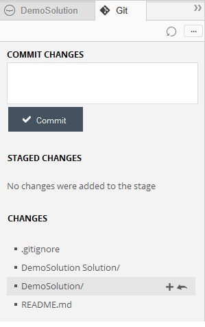
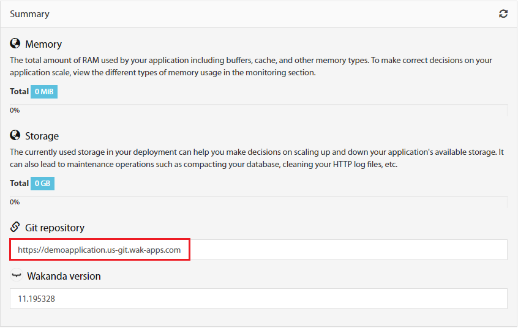
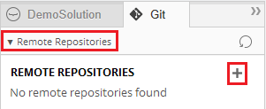
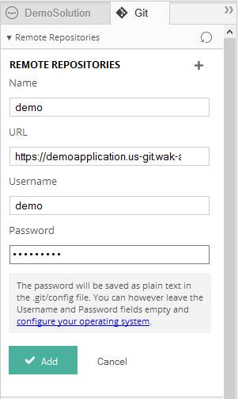
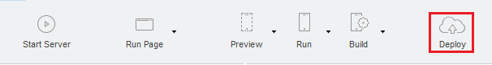
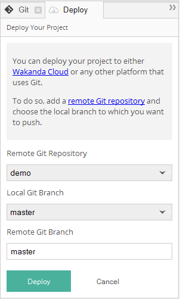
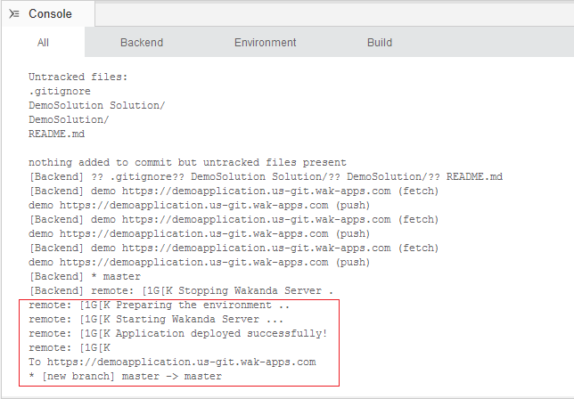
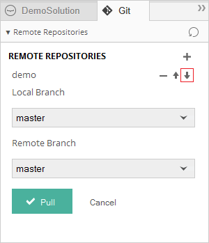

===============
Getting Started
===============

*******************************
Creating your first application
*******************************

Once you have created an account in the [Wakanda Cloud Console](https://console.wakanda.io), connect to the dashboard, click on the ``New Application`` button to open the application creation wizard.

.. image:: images/noapps.png
	:align: center
	
Start by choosing an application type from the suggestions. In our example, we will be creating a free application. To proceed, click on the ``Free application`` button.

.. image:: images/free_application.png
	:align: center
	
By default, your application will be created in the US. If you prefer a different region, you can select it from the list.

.. image:: images/region.png
	:align: center
.. note::

    As of the moment, only the US region is available

Choose a valid application name:

.. image:: images/domain.png
	:align: center

Optionally, you can add custom domains to your application's configuration.

.. image:: images/custom_domains.png
	:align: center

In the next step, you are invited to provide your user's information

.. image:: images/user_information.png
	:align: center

.. note::

    Before proceeding to the next step, all the required fields must be filled.
    The required fields are:
    - Personal information: first name and last name
    - Billing information: address, country and zip code

Before creating your application, you must agree to our terms of service and then click on the ``save`` button.

.. image:: images/save.png
	:align: center

**************************************
Publishing & updating your application
**************************************

Publishing your code the first time is the same as updating an already deployed application. All you need to do is push your code to your application's remote repository.

Application remote repository
=============================

.. image:: images/2_git_repository.png
	:align: center
	
	
It is an unique URL that points to your cloud git repository.  The URL information is available in the app’s git repository section.

.. image:: images/2_git_repository.png
	:align: center
	

Having the "application remote repository" allows you to push code using the Wakanda Studio,  or a  Git Command Line, or any IDE that supports Git Smart HTTP.

Using Wakanda Studio
====================
Create a local git repository and commit your changes by adding all the folders you want to source control. After that, define your remote repository and deploy whenever you are ready to your cloud. 

Create your local git repository
********************************
From the solution explorer on Wakanda Studio, open the Git Panel and click on ``Create Git Repository``.

Add your folders and commit your changes
****************************************
Add changes to your stage and commit:

Add your Remote Repository
**************************
Retrieve your remote repository URL from your Wakanda Cloud Administration Console:

Open the remote repositories panel and setup your remote repository settings:

	
The Username and Password for your Remote Git repository are your Cloud Console Credentials.

Deploy
******
Click on "Deploy" from the Studio toolbar:

	
Select your Remote Git Repository and setup you Remote Git Branch to "master":

	
If the operation was successful, you will receive details about the update. Otherwise, you will receive a message explaining any errors that occurred.

Using the command line
======================

Push your application to the remote repository by using the following command ::

    $ git push https://[my-application-name].us-git.wak-apps.com master

.. note::

    If your local repository is using a branch name other than ``master``, you must use the following command to push your application to the remote repository ::

    $ git push https://[my-application-name].us-git.wak-apps.com [local-branch-name]:master
    
*********************************
Clone From your Cloud Application
*********************************

Using Wakanda Studio
====================
Open The Git Panel and select your Remote Git Repository, then click on "Pull":

	
Using the command line
======================
Clone your application from your Cloud remote repository by using the following command ::

$ git clone https://[my-application-name].us-git.wak-apps.com
