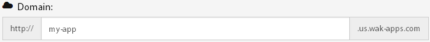
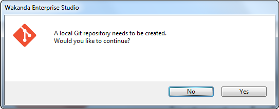
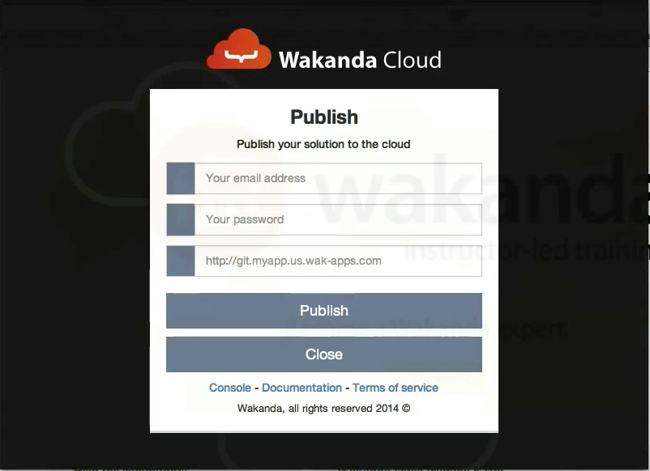

===============
Getting Started
===============

The following video demonstrates how to create an application from the dashboard and how to deploy and update it using Wakanda Studio.

.. raw:: html

 <iframe width="420" height="315" src="//www.youtube.com/embed/OfgUGqCKHUU" frameborder="0" allowfullscreen></iframe>  

*******************************
Creating your first application
*******************************

Once you are connected to your dashboard, click on the ``create your first app`` link to open the application creation wizard.

.. image:: images/noapps.png

Start by choosing an application type from the suggestions. In our example, we will be creating a free application. To proceed, click on the ``Try it now`` button.

.. image:: images/try_it_now.png

By default, your application will be created in the US region. If you prefer a different region, select it from the list.

.. image:: images/region.png

Choose a valid application name:

Optionally, you can add subdomains and custom domains to your application's configuration.

.. image:: images/subdomains.png

.. image:: images/custom_domains.png

To create your application, click on the ``Finish`` button.

**********************************************
Develop your application with Wakanda Studio 
**********************************************

First you need to download_ Wakanda : http://www.wakanda.org/downloads

To install wakanda follow the steps: installation_

Now you can develop your first wakanda application, click here_ for more details

*************************
Publishing & Updating your application
*************************

Publishing your code the first time is the same as updating an already deployed application. All you need to do is push your new code to your application's remote repository, which can be done using Wakanda Studio's PaaS Extension, Git Command Line, or any IDE that supports Git Smart HTTP.

Application remote repository
=============================

You can get your application's remote repository URL by clicking the ``copy repository`` button. 

.. image:: images/git_copy_repo.png

Using Wakanda Studio
====================

Once you have opened your solution in Wakanda Studio, click on the PaaS extension button in the toolbar and select the ``update`` menu item.

.. image:: images/studio_update_menu.png

If you have not initialized a local Git repository for your solution, you will be prompted to create one. To do so, click on the ``Yes`` button.

Fill in your PaaS login information and your `application remote repository`_ URL and click on ``Publish``.

If the operation was successful, you will receive details about the update. Otherwise, you will receive a message explaining any errors that have occurred.

.. image:: images/studio_published_dialog.png

Using the command line
======================

Push your application to the remote repository using the following command ::

    $ git push http://git.[my-application-name].us.wak-apps.com master

.. note::

    If your local repository is using a branch name other than ``master``, you must use the following command to push your application to the remote repository ::

    $ git push http://git.[my-application-name].us.wak-apps.com [local-branch-name]:master
    
.. _download: http://www.wakanda.org/downloads
.. _installation: http://doc.wakanda.org/home2.fr.html#/Installing-Wakanda/Installing-Wakanda.100-689089.en.html
.. _here: http://doc.wakanda.org/home2.fr.html#/Quick-Start/Quick-Start.100-695763.en.html
