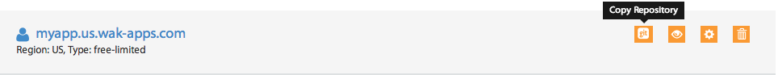
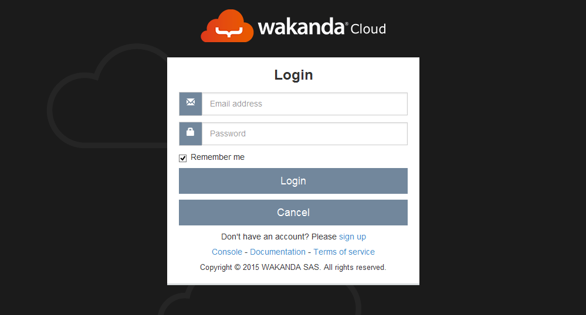

===============
Getting Started
===============

The following video demonstrates how to create an application from the dashboard and how to deploy and update it using Wakanda Studio.

.. raw:: html

 

  

*******************************
Creating your first application
*******************************

Once you are connected to your dashboard, click on the ``New Application`` button to open the application creation wizard.

.. image:: images/noapps.png
	:align: center
	
Start by choosing an application type from the suggestions. In our example, we will be creating a free application. To proceed, click on the ``Try it now`` button.

.. image:: images/try_it_now.png
	:align: center
	
By default, your application will be created in the US region. If you prefer a different region, select it from the list.

.. image:: images/region.png
	:align: center
.. note::

    Only the US region is available during the beta program

Choose a valid application name:

.. image:: images/domain.png
	:align: center

Optionally, you can add subdomains and custom domains to your application's configuration.

.. image:: images/subdomains.png
	:align: center

.. image:: images/custom_domains.png
	:align: center

To create your application, click on the ``Finish`` button.

.. image:: images/finish.png
	:align: center
	
***********************************************
Developing your application with Wakanda Studio
***********************************************

First you need to download_ Wakanda : http://www.wakanda.org/downloads

To install Wakanda follow the steps: installation_

Now you can develop your first Wakanda application, click here_ for more details

**************************************
Publishing & Updating your application
**************************************

Publishing your code the first time is the same as updating an already deployed application. All you need to do is push your new code to your application's remote repository, which can be done using Wakanda Studio's Cloud Extension, Git Command Line, or any IDE that supports Git Smart HTTP.

Application remote repository
=============================

You can get your application's remote repository URL by clicking the ``copy repository`` button. 

Using Wakanda Studio
====================

Once you have opened your solution in Wakanda Studio, click on the Cloud extension button in the toolbar and select the ``Publish`` menu item.

.. image:: images/studio_update_menu.png
	:align: center

Fill in your Wakanda Cloud login information and click on ``Login``. If you want the studio to remember your credentials check the ``Remember me`` option.

.. note::

    If you check the ``Remember me`` option your credentials will be saved as clear text in the cloud extension preferences.
	
if this is your first deployment, you will need to select the domain that you want to associate to your application.

If the operation was successful, you will receive details about the update. Otherwise, you will receive a message explaining any errors that have occurred.

.. image:: images/studio_published_dialog.png

Using the command line
======================

Push your application to the remote repository using the following command ::

    $ git push https://[my-application-name].us-git.wak-apps.com master

.. note::

    If your local repository is using a branch name other than ``master``, you must use the following command to push your application to the remote repository ::

    $ git push https://[my-application-name].us-git.wak-apps.com [local-branch-name]:master
    
.. _download: http://www.wakanda.org/downloads
.. _installation: http://doc.wakanda.org/home2.fr.html#/Installing-Wakanda/Installing-Wakanda.100-689089.en.html
.. _here: http://doc.wakanda.org/home2.fr.html#/Quick-Start/Quick-Start.100-695763.en.html